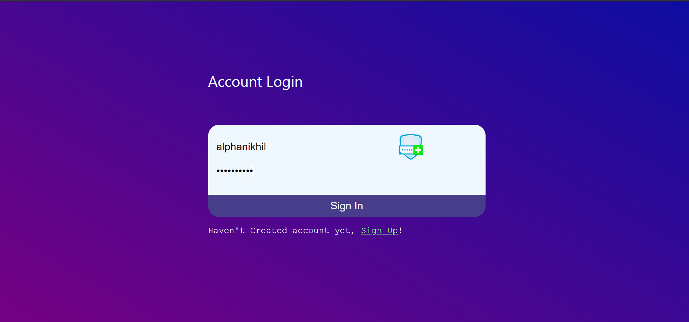
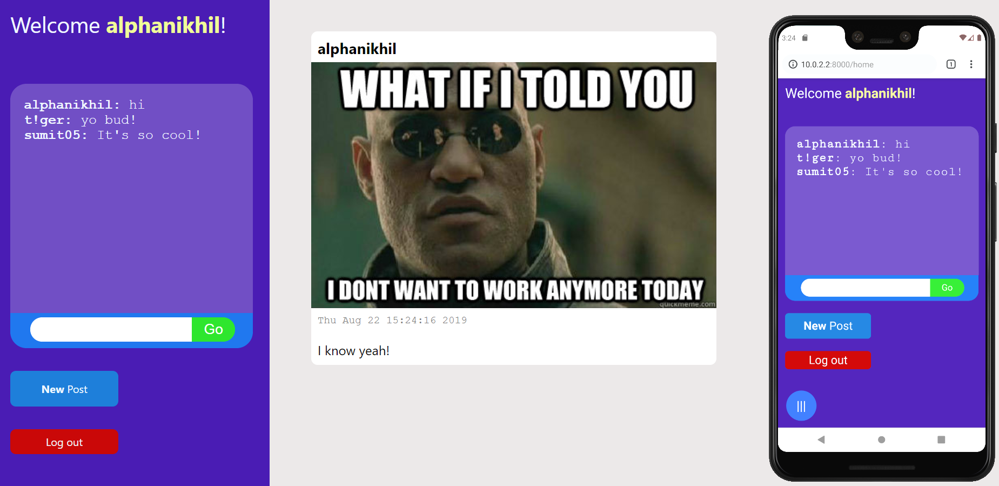
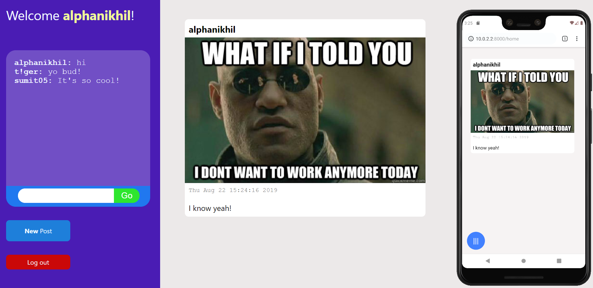
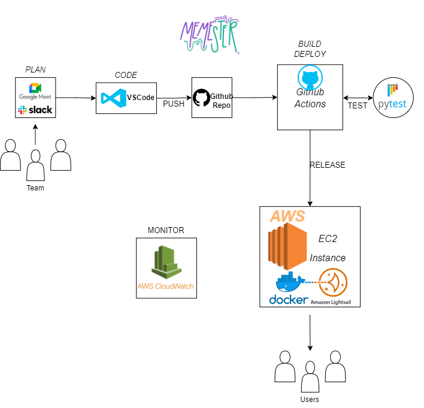

# Memester
Memester is social media platform that is used for chatting with other users and share memes or images.

## Features
- Password Hashing (SHA_512)
- Sign up/Sign In
- Global Chat
- Add Post (Videos or Images)

## Demo

# Architecture  

# How to run the project locally
## Prerequisite
- [Python](https://www.python.org/) (needed for running the project and [PyTest](https://docs.pytest.org/en/7.2.x/))
- Python IDE of your choosing (we chose to use [VS Code](https://code.visualstudio.com/))
- [Git](https://github.com/git-guides/install-git)

## Setup

1. Make sure you have Python, Git, and your IDE of choice setup on your computer
2. Open up the command line of your choosing
3. navigate to the directory where you want to run the project
4. run the following commands:
5. git clone https://github.com/strategio-tech/fp-sim6-ec2read.git
6. cd fp-sim6-ec2read
7. pip install -r requirements.txt
8. python app.py
9. Navigate to a web browser
10. Go to http://localhost:8000
11. There is the project in all of it's glory! 
